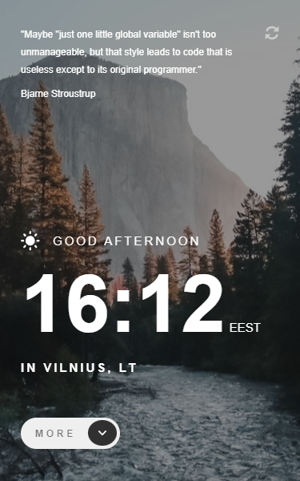

# Frontend Mentor - Clock app solution

This is a solution to the [Clock app challenge on Frontend Mentor](https://www.frontendmentor.io/challenges/clock-app-LMFaxFwrM). Frontend Mentor challenges help you improve your coding skills by building realistic projects.

## Table of contents

- [Overview](#overview)
  - [The challenge](#the-challenge)
  - [Screenshot](#screenshot)
  - [Links](#links)
- [My process](#my-process)
  - [Built with](#built-with)
  - [What I learned](#what-i-learned)
  - [Useful resources](#useful-resources)
- [Author](#author)
- [Acknowledgments](#acknowledgments)

## Overview

### The challenge

Users should be able to:

- View the optimal layout for the site depending on their device's screen size
- See hover states for all interactive elements on the page
- View the current time and location information based on their IP address
- View additional information about the date and time in the expanded state
- Be shown the correct greeting and background image based on the time of day they're visiting the site
- Generate random programming quotes by clicking the refresh icon near the quote

### Screenshot




### Links

- Solution URL: [Github Repo](https://github.com/KarolisGaiv/clock-app)
- Live Site URL: [Check it out live!](https://karolisgaiv.github.io/clock-app/)

## My process

### Built with

- CSS custom properties
- Flexbox
- CSS Grid
- Mobile-first workflow
- BEM
- [React](https://reactjs.org/) - JS library

### What I learned

This was my first project where I have used classNames package. This is a neat package which in my opinion really helps with classnames, especially when using BEM methodology.

```js
const backgroundClasses = classNames('background', {
    'background --night': isNightPhase === true,
    'background --day': isNightPhase === false,
  });
};
```

### Useful resources

- [useEffect explanation](https://javascript.plainenglish.io/using-reacts-useeffect-hook-to-fetch-data-and-periodically-refresh-that-data-2a69b6d44081) - This helped me to control fetching local time API data. They have a clear explanation of how and why to use setInterval funcionality in useEffect hook.

- [classNames package explanation](https://www.youtube.com/watch?v=LakwDt7K_OQ) - This is an amazing video which shortly explains how to use classNames package.

## Author

- Frontend Mentor - [@KarolisGaiv](https://www.frontendmentor.io/profile/KarolisGaiv)
